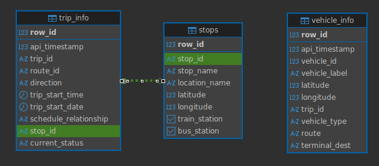

# GO Transit Vehicle Dashboard

This project is a Grafana dashboard that shows the live position of all GO transit vehicles that updates every 10 seconds.


The backend requests data from [Metrolinx's API](https://api.openmetrolinx.com/OpenDataAPI/Help/Index/en) and stores it in a local PostgreSQL database, which Grafana then pulls from. Below is a summary of the main components of the pipeline.

## Metrolinx API
A Python script uses `httpx` to get data from Metrolinx using their API. An access key was requested and manually approved by their team to allow access to their API.

## PosgreSQL Database



## Grafana Dashboard
To build the map dashboard, Grafana's `Geomap` panel was used. However, it is limited in functionality (no user interactions such as filtering) due to security reasons as it must have permission to query the database.

In order to easily share the dashboard externally, the dashboard is hosted on the free tier of Grafana Cloud.

The dashboard can be viewed [here](https://ihong.grafana.net/public-dashboards/b1aa5174d2f34e889458f6cd1c6cd140).


# Backend Setup
Before setting up the project, there are a few prerequisites:
* An access key must be obtained from Metrolinx.
* PostgreSQL must be installed.
* `uv` is used for package management.
* A `.env` file is required with the following fields:
    ```
    ENDPOINT_URL=https://api.openmetrolinx.com/OpenDataAPI/api/V1
    API_KEY=
    DB_USER=
    DB_PASSWORD=
    DB_NAME=
    SERVER_IP=
    ```

Now for the actual backend setup:

1. Create the database by running `sql_scripts/db_setup.sql` in PostgreSQL.
2. Install packages from `pyproject.toml`:
    ```
    uv sync
    ```
3. Run the logger to start requesting data from Metrolinx and logging to the database.
    ```
    uv run utilities/data_logger.py
    ```

To run it perpetually, it is recommended to run it as as `systemd` service.